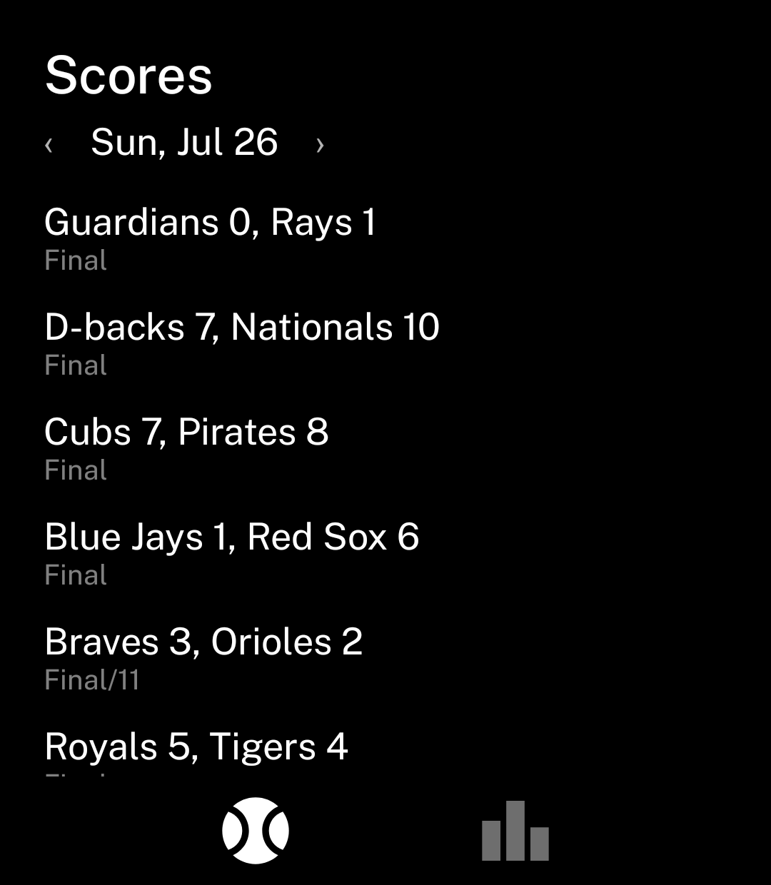
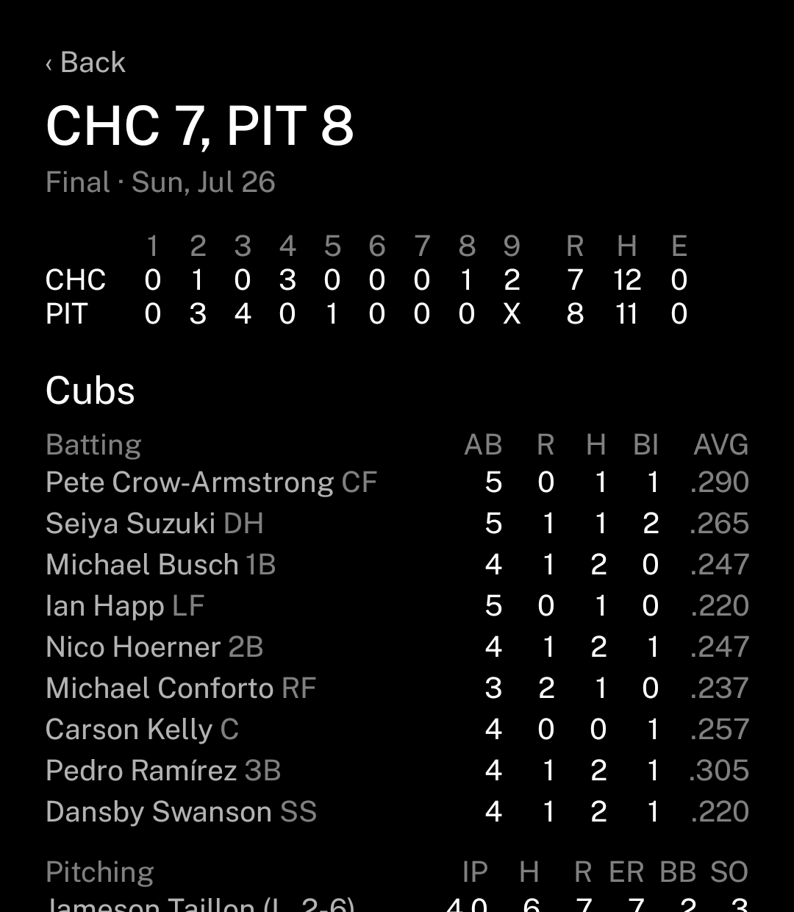
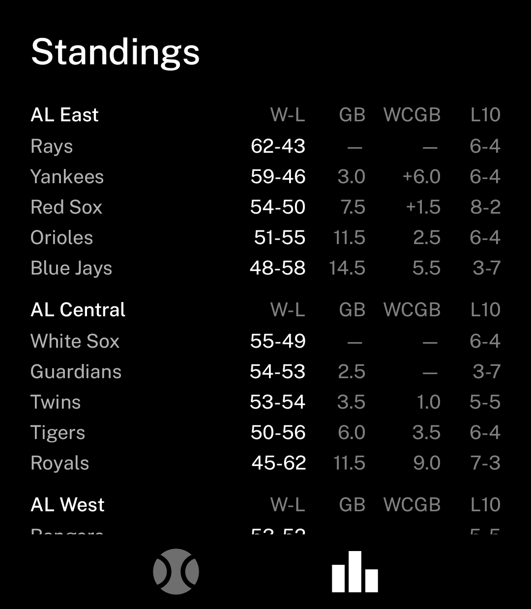

# Dugout

MLB scores, box scores, and standings for the
[Light Phone III](https://www.thelightphone.com/).

A black-and-white, text-first baseball companion in the style of
[vandamd](https://github.com/vandamd)'s LightOS tools. No ads, no video, no
notifications — just the day's slate, classic box scores, and the standings.

<p align="center">
  
  
  
</p>

## Features

- **Scores** — the full slate for any date, with `‹ date ›` arrows to browse
  and a tap on the date to jump back to today. Live games show the inning
  ("Bot 2nd"), finished games the final ("Final/11"), upcoming games the
  start time. Auto-refreshes every 60 seconds while games are live.
- **Box scores** — tap any started game for a classic box score: per-inning
  linescore with R/H/E (scrolls sideways for extra innings), full batting
  and pitching tables with substitutions indented and pitcher decisions
  ("(W, 8-3)"), and for live games the current count, runners, and outs.
  Auto-refreshes every 45 seconds while the game is live.
- **Standings** — all six divisions with W-L, games back, wild card games
  back, and last-ten record.

Everything is drawn in Public Sans on pure black, matching the LightOS look:
no images, no color, no scrollbars — just text you can read at a glance.

## Install

1. Download `dugout-vX.Y.apk` from the
   [latest release](../../releases/latest).
2. With your Light Phone III connected over USB (ADB enabled):

   ```sh
   adb install -r dugout-vX.Y.apk
   ```

Dugout is a normal Android app — no Google Play services required, internet
permission only.

## Build from source

Requires JDK 21 and the Android SDK (API 35). Point Gradle at your SDK via
`local.properties` (`sdk.dir=...`) or the `ANDROID_HOME` environment
variable.

```sh
./gradlew assembleRelease   # minified APK at app/build/outputs/apk/release/
./gradlew assembleDebug     # unminified, much larger
adb install -r app/build/outputs/apk/release/app-release.apk
```

The release APK is debug-signed so it sideloads without a keystore of your
own.

## Data

All data comes from MLB's free, public Stats API (`statsapi.mlb.com`) — no
account, no API key. Per MLB Advanced Media's terms this data is for
**personal, non-commercial use only**. This project is not affiliated with
or endorsed by Major League Baseball. Major League Baseball data ©
MLB Advanced Media, LP.

## Credits

Inspired by the Light Phone community tools from
[vandamd](https://github.com/vandamd). Typeface is
[Public Sans](https://public-sans.digital.gov/).
